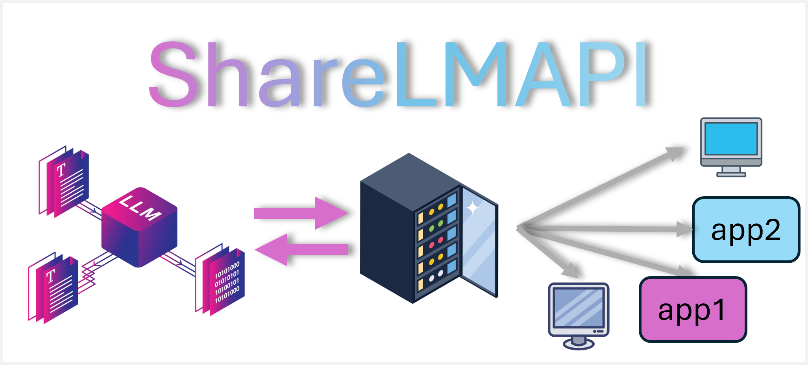

# ShareLMAPI
English | [中文](README_CN.md)

ShareLMAPI is a local language model sharing API that uses FastAPI to provide interfaces, allowing different programs to share the same local model, thereby reducing resource consumption. It supports streaming generation and various model configuration methods.

## Table of Contents

- [Features](#features)
- [Installation](#installation)
- [Configuration](#configuration)
- [Usage](#usage)
- [Docker Guide](#docker-guide)
- [API Documentation](#api-documentation)
- [Client Usage](#client-usage)
- [Testing](#testing)
- [Contributing](#contributing)
- [License](#license)

## Features

- Support for multiple model loading methods: default, BitsAndBytes quantization, PEFT
- Support for streaming and non-streaming text generation
- Support for dialogue history and system prompts
- Easy to configure and extend
- Flexible model server URL configuration

## Installation

### 1. Clone the Repository

```bash
git clone https://github.com/starpig1129/ShareLMAPI.git
cd ShareLMAPI
```

### 2. Install Dependencies

Dependencies can be installed using either Conda or Pip.

Using Conda:

```bash
conda env create -f environment.yml
conda activate ShareLMAPI
```

Using Pip:

```bash
pip install -r requirements.txt
```

### 3. Local Installation

If you plan to use it locally, install the package using:

```bash
pip install -e .
```

## Configuration

1. Navigate to the `configs` directory and open `model_config.yaml`.
2. Modify the configuration according to your needs. You can specify:
   - Model name
   - Loading method (default, bitsandbytes, or peft)
   - Device (CPU or CUDA)
   - Other model-specific settings
   - Model server URL

Configuration example:

```yaml
model:
  name: "gpt-2"
  loading_method: "default"
  default:
    device: "cuda"
  bitsandbytes:
    device: "cuda"
    quantization_config:
      quant_type: "nf4"
      load_in_4bit: True
      bnb_4bit_quant_type: "nf4"
      bnb_4bit_compute_dtype: "float16"
      bnb_4bit_use_double_quant: False
  peft:
    device: "cuda"
    peft_type: "lora"
    peft_config:
      r: 8
      lora_alpha: 16
      lora_dropout: 0.1
      target_modules: ["q_proj", "v_proj"]

model_server:
  model_server_url: "http://localhost:5000"
```

## Usage

### Start the Model Server

First, start the model server to load and manage the language model:

```bash
uvicorn ShareLMAPI.server.model_server:app --host 0.0.0.0 --port 5000
```

### Start the Frontend API Server

After the model server is running, start the frontend server to handle client requests:

```bash
gunicorn -w 4 -k uvicorn.workers.UvicornWorker ShareLMAPI.server.server:app --bind 0.0.0.0:8000
```

## Docker Guide

If you want to use Docker to run ShareLMAPI, follow these steps:

### 1. Build Docker Image

Run the following command in the directory containing the Dockerfile to build the Docker image:

```bash
docker build -t sharelmapi .
```

This will create a Docker image named `sharelmapi`.

### 2. Run Docker Container

After building, use the following command to run the container:

```bash
docker run -p 5000:5000 -p 8000:8000 sharelmapi
```

This will start the container and map ports 5000 and 8000 from the container to the corresponding ports on the host.

### 3. Access the API

You can now access the API via `http://localhost:8000`, just like in a non-Docker environment.

### Notes

- Ensure that the model settings in your `model_config.yaml` file are suitable for running in a Docker environment.
- Consider using Docker volumes if you need to persist data or configurations.
- For large models, ensure your Docker host has sufficient resources (especially GPU support, if needed).

## API Documentation

### 1. `/generate_stream`

Generate model responses and stream the results.

* **Method**: `POST`
* **URL**: `http://localhost:8000/generate_stream`
* **Parameters**:
   * `dialogue_history`: List of dialogue messages (optional)
   * `prompt`: User input prompt (if dialogue history is not provided)
   * `max_length`: Maximum number of tokens to generate
   * `temperature`: Parameter to control generation randomness
   * `generation_kwargs`: Other generation parameters (optional)

### 2. `/generate`

Generate model responses without streaming.

* **Method**: `POST`
* **URL**: `http://localhost:8000/generate`
* **Parameters**: Same as `/generate_stream`

## Client Usage
### Installation
```bash
pip install ShareLMAPI
```
Here's an example of how to use `ShareLMAPI` to call the API:

```python
from ShareLMAPI.client import ShareLMAPIClient

# Create API client
client = ShareLMAPIClient(base_url="http://localhost:8000")

# Streaming generation
for chunk in client.generate_text("Once upon a time", max_length=50, streamer=True):
    print(chunk, end='', flush=True)

# Non-streaming generation
response = client.generate_text("What is the capital of France?", max_length=50, streamer=False)
print(response)

# Using dialogue history
dialogue_history = [
    {"role": "user", "content": "Hello, who are you?"},
    {"role": "assistant", "content": "I'm an AI assistant. How can I help you today?"},
    {"role": "user", "content": "Can you explain quantum computing?"}
]
response = client.generate_text(dialogue_history=dialogue_history, max_length=200, streamer=False)
print(response)
```

## Testing

Run the following command in the project root directory to execute tests:

```bash
pytest -s tests/test_client.py
```

This will run the tests and display the output results.

## Contributing

Contributions of any form are welcome. Please follow these steps:

1. Fork this repository
2. Create your feature branch (`git checkout -b feature/AmazingFeature`)
3. Commit your changes (`git commit -m 'Add some AmazingFeature'`)
4. Push to the branch (`git push origin feature/AmazingFeature`)
5. Open a Pull Request

## License

This project is open-sourced under the MIT License. See the [LICENSE](LICENSE) file for more details.

## Other Projects
Here are some of my other notable projects:

PigPig: Advanced Multi-modal LLM Discord Bot: 
A powerful Discord bot based on multi-modal Large Language Models (LLM), designed to interact with users through natural language. 
It combines advanced AI capabilities with practical features, offering a rich experience for Discord communities.
- GitHub: [ai-discord-bot-PigPig](https://github.com/starpig1129/ai-discord-bot-PigPig)

AI-data-analysis-MulitAgent:
An AI-powered research assistant system that utilizes multiple specialized agents to assist in tasks such as data analysis, visualization, and report generation. The system employs LangChain, OpenAI's GPT models, and LangGraph to handle complex research processes, integrating diverse AI architectures for optimal performance.
- GitHub: [ai-data-analysis-MulitAgent](https://github.com/starpig1129/ai-data-analysis-MulitAgent)