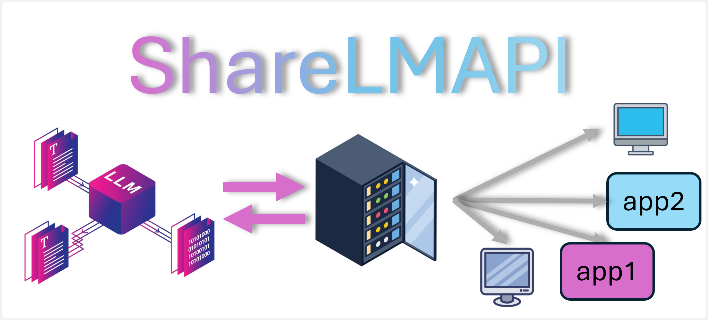

# ShareLMAPI
[English](README.md) | 中文

ShareLMAPI 是一個本地語言模型共享 API，使用 FastAPI 提供接口，允許不同的程序共享同一個本地模型，從而減少資源消耗。它支持流式生成和多種模型配置方法。

## 目錄

- [功能特點](#功能特點)
- [安裝](#安裝)
- [配置](#配置)
- [使用方法](#使用方法)
- [Docker 使用教學](#docker-使用教學)
- [API 文檔](#api-文檔)
- [客戶端使用](#客戶端使用)
- [測試](#測試)
- [貢獻](#貢獻)
- [許可證](#許可證)

## 功能特點

- 支持多種模型加載方法：默認、BitsAndBytes 量化、PEFT
- 支持流式和非流式文本生成
- 支持對話歷史和系統提示
- 易於配置和擴展
- 靈活的模型服務器 URL 配置

## 安裝

### 1. 克隆存儲庫

```bash
git clone https://github.com/starpig1129/ShareLMAPI.git
cd ShareLMAPI
```

### 2. 安裝依賴

可以使用 Conda 或 Pip 安裝依賴。

使用 Conda：

```bash
conda env create -f environment.yml
conda activate ShareLMAPI
```

使用 Pip：

```bash
pip install -r requirements.txt
```

### 3. 本地安裝

如果您預計在本地使用，請使用以下命令安裝：

```bash
pip install -e .
```

## 配置

1. 導航到 `configs` 目錄並打開 `model_config.yaml`。
2. 根據您的需求修改配置。您可以指定：
   - 模型名稱
   - 加載方法（default、bitsandbytes 或 peft）
   - 設備（CPU 或 CUDA）
   - 其他特定於模型的設置
   - 模型服務器 URL

配置示例：

```yaml
model:
  name: "gpt-2"
  loading_method: "default"
  default:
    device: "cuda"
  bitsandbytes:
    device: "cuda"
    quantization_config:
      quant_type: "nf4"
      load_in_4bit: True
      bnb_4bit_quant_type: "nf4"
      bnb_4bit_compute_dtype: "float16"
      bnb_4bit_use_double_quant: False
  peft:
    device: "cuda"
    peft_type: "lora"
    peft_config:
      r: 8
      lora_alpha: 16
      lora_dropout: 0.1
      target_modules: ["q_proj", "v_proj"]

model_server:
  model_server_url: "http://localhost:5000"
```

## 使用方法

### 啟動模型服務器

首先，啟動模型服務器以加載和管理語言模型：

```bash
uvicorn ShareLMAPI.server.model_server:app --host 0.0.0.0 --port 5000
```

### 啟動前端 API 服務器

模型服務器運行後，啟動前端服務器來處理客戶端請求：

```bash
gunicorn -w 4 -k uvicorn.workers.UvicornWorker ShareLMAPI.server.server:app --bind 0.0.0.0:8000
```

## Docker 使用教學

如果您想使用 Docker 來運行 ShareLMAPI，請按照以下步驟操作：

### 1. 構建 Docker 鏡像

在含有 Dockerfile 的目錄中運行以下命令來構建 Docker 鏡像：

```bash
docker build -t sharelmapi .
```

這將創建一個名為 `sharelmapi` 的 Docker 鏡像。

### 2. 運行 Docker 容器

構建完成後，使用以下命令來運行容器：

```bash
docker run -p 5000:5000 -p 8000:8000 sharelmapi
```

這將啟動容器，並將容器內的 5000 和 8000 端口映射到主機的相應端口。

### 3. 訪問 API

現在，您可以通過 `http://localhost:8000` 訪問 API，就像非 Docker 環境中一樣。

### 注意事項

- 確保您的 `model_config.yaml` 文件中的模型設置適合在 Docker 環境中運行。
- 如果您需要持久化數據或配置，考慮使用 Docker 卷。
- 對於大型模型，確保您的 Docker 主機有足夠的資源（特別是 GPU 支持，如果需要的話）。

## API 文檔

### 1. `/generate_stream`

生成模型回應並流式傳輸結果。

* **方法**：`POST`
* **URL**：`http://localhost:8000/generate_stream`
* **參數**：
   * `dialogue_history`：對話消息列表（可選）
   * `prompt`：用戶輸入提示（如果未提供對話歷史）
   * `max_length`：生成的最大 token 數量
   * `temperature`：控制生成隨機性的參數
   * `generation_kwargs`：其他生成參數（可選）

### 2. `/generate`

生成模型回應，不使用流式傳輸。

* **方法**：`POST`
* **URL**：`http://localhost:8000/generate`
* **參數**：與 `/generate_stream` 相同

## 客戶端使用
### 安裝
```bash
pip install ShareLMAPI
```
以下是使用 `ShareLMAPI` 調用 API 的示例：

```python
from ShareLMAPI.client import ShareLMAPIClient

# 創建 API 客戶端
client = ShareLMAPIClient(base_url="http://localhost:8000")

# 流式生成
for chunk in client.generate_text("從前有一個", max_length=50, streamer=True):
    print(chunk, end='', flush=True)

# 非流式生成
response = client.generate_text("法國的首都是什麼？", max_length=50, streamer=False)
print(response)

# 使用對話歷史
dialogue_history = [
    {"role": "user", "content": "你好，你是誰？"},
    {"role": "assistant", "content": "我是一個 AI 助手。今天我能為您做些什麼？"},
    {"role": "user", "content": "你能解釋一下量子計算嗎？"}
]
response = client.generate_text(dialogue_history=dialogue_history, max_length=200, streamer=False)
print(response)
```

## 測試

在項目根目錄中運行以下命令來執行測試：

```bash
pytest -s tests/test_client.py
```

這將運行測試並顯示輸出結果。

## 貢獻

歡迎任何形式的貢獻。請遵循以下步驟：

1. Fork 此存儲庫
2. 創建您的功能分支（`git checkout -b feature/AmazingFeature`）
3. 提交您的更改（`git commit -m 'Add some AmazingFeature'`）
4. 推送到分支（`git push origin feature/AmazingFeature`）
5. 開啟一個 Pull Request

## 許可證

本項目基於 MIT 許可證開源。詳情請參見 [LICENSE](LICENSE) 文件。

## 其他專案
這裡是我的其他一些值得注意的專案：

PigPig：先進的多模態 LLM Discord 機器人：
這是一個基於多模態大型語言模型（LLM）的強大 Discord 機器人，旨在通過自然語言與用戶互動。
它結合了先進的 AI 功能和實用的特性，為 Discord 社群提供了豐富的使用體驗。
- GitHub: [ai-discord-bot-PigPig](https://github.com/starpig1129/ai-discord-bot-PigPig)

AI-data-analysis-MulitAgent：
這是一個由 AI 驅動的研究助理系統，利用多個專門代理來幫助完成數據分析、視覺化和報告生成等任務。該系統使用 LangChain、OpenAI 的 GPT 模型和 LangGraph 來處理複雜的研究流程，整合了多樣化的 AI 架構以達到最佳性能。

- GitHub: [ai-data-analysis-MulitAgent](https://github.com/starpig1129/ai-data-analysis-MulitAgent)